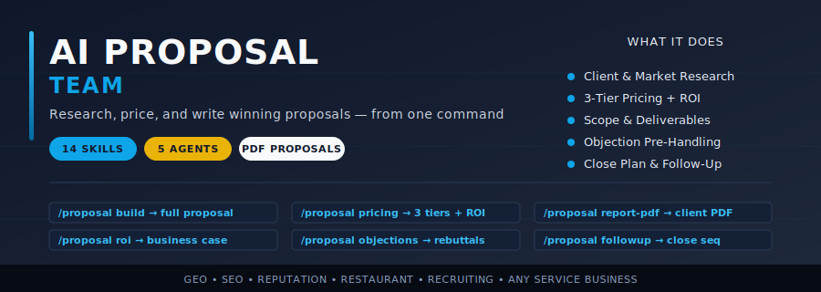

<p align="center">
  
</p>

<p align="center">
  <strong>AI-powered proposal-writing and deal-closing engine</strong> for Claude Code.<br/>
  Research a prospect, price the engagement, quantify ROI, pre-handle objections — and produce a client-ready PDF proposal in minutes.
</p>

<p align="center">
  <a href="#quick-start"></a>
  
  
  
  
</p>

---

## ⭐ Why This Exists

Agencies, freelancers, and consultants lose most deals **at the proposal stage** — not at the pitch. A weak proposal kills the entire deal after all the work of finding and pitching the client.

Most losing proposals share four invisible failures:

1. **Generic, not specific** — a template that could've been sent to anyone, so the client never feels understood
2. **Naked pricing** — a number with no ROI context, so it reads as a cost instead of an investment
3. **No tier structure** — one take-it-or-leave-it price instead of Good-Better-Best, so there's no easy "yes"
4. **No close plan** — the proposal gets sent into a void with no follow-up sequence

The **AI Proposal Team** turns Claude Code into a full proposal department you can run from the command line. It launches **5 parallel agents** to research the client, build pricing, define scope, quantify ROI, and engineer the close — then produces a polished, client-ready PDF with a composite **Proposal Strength Score (0-100)**.

**The killer feature:** it auto-detects audit reports in your working directory (from the GEO, SEO, Reputation, Restaurant, and Recruiting Claude Code tools) and builds the proposal around the *real findings* — so the proposal lands as "this agency already understands my problem," not a cold template.

---

## 🚀 What It Does

When you run `/proposal build <client>`, the orchestrator launches **5 parallel AI agents**:

| Agent | Weight | What It Builds |
|-------|--------|----------------|
| **Problem-Solution Fit** | 20% | Client research, evidenced pain points, competitive context |
| **Pricing & ROI Clarity** | 20% | 3-tier Good-Better-Best pricing with ROI math per tier |
| **Scope & Deliverables** | 20% | Phased plan, deliverables, timeline, exclusions |
| **Value & Business Case** | 20% | ROI projections, cost of inaction, three scenarios |
| **Persuasion & Close** | 20% | Executive summary, proof, objections, next steps |

It then produces a composite **Proposal Strength Score (0-100)** with letter grade and a complete proposal document.

### Feature Highlights

| Feature | Description |
|---------|-------------|
| **Full Proposal Build** | 5 parallel agents construct every section simultaneously |
| **Proposal Strength Score** | Weighted composite 0-100 with A+ to F grade and signal |
| **Audit-Driven** | Auto-detects GEO/SEO/Reputation/Restaurant/Recruiting reports and uses real findings |
| **3-Tier Pricing** | Good-Better-Best with the middle tier marked RECOMMENDED and the top tier anchoring |
| **ROI Projections** | Conservative / moderate / aggressive scenarios with stated assumptions |
| **Objection Pre-Handling** | Defuses the objections your proposal will trigger before they're raised |
| **Follow-Up Sequence** | A 4-email close sequence ships with every proposal |
| **Statement of Work** | Turn an accepted proposal into a clean SOW |
| **Upsell Proposals** | Expansion proposals for existing clients, built on delivered results |
| **PDF Proposals** | Polished client-ready PDF with branded cover and highlighted pricing |

---

## Quick Start

### One-Command Install (macOS / Linux)

```bash
curl -fsSL https://raw.githubusercontent.com/zubair-trabzada/ai-proposal-claude/main/install.sh | bash
```

### Manual Install

```bash
git clone https://github.com/zubair-trabzada/ai-proposal-claude.git
cd ai-proposal-claude
./install.sh
```

### Requirements

- Python 3.8+
- Claude Code CLI
- Git
- `reportlab` (installed automatically)

---

## Commands

Open Claude Code and use these commands:

| Command | What It Does | Output |
|---------|--------------|--------|
| `/proposal build <client>` | Full winning proposal (5 parallel agents) | `PROPOSAL-*.md` |
| `/proposal quick <client>` | 60-second proposal outline | Terminal output |
| `/proposal pricing <service>` | 3-tier pricing builder with ROI | `PROPOSAL-PRICING-*.md` |
| `/proposal scope <service>` | Scope, deliverables & phased plan | `PROPOSAL-SCOPE-*.md` |
| `/proposal roi <client>` | ROI projection & business case | `PROPOSAL-ROI-*.md` |
| `/proposal summary <client>` | Executive summary writer | `PROPOSAL-SUMMARY-*.md` |
| `/proposal case-study <result>` | Case study generator | `PROPOSAL-CASESTUDY.md` |
| `/proposal objections <client>` | Pre-handle objections | `PROPOSAL-OBJECTIONS-*.md` |
| `/proposal followup <client>` | Post-send follow-up sequence | `PROPOSAL-FOLLOWUP-*.md` |
| `/proposal cover <client>` | Proposal delivery email | `PROPOSAL-COVER-*.md` |
| `/proposal compare <a> <b>` | Compare two proposal approaches | `PROPOSAL-COMPARE.md` |
| `/proposal upsell <client>` | Expansion proposal for existing client | `PROPOSAL-UPSELL-*.md` |
| `/proposal sow <client>` | Statement of Work | `PROPOSAL-SOW-*.md` |
| `/proposal report-pdf` | Professional PDF proposal | `PROPOSAL-*.pdf` |

---

## 🤖 How It Works — The 5 Parallel Agents

When you run `/proposal build <client>`, the orchestrator:

1. **Detects context** — scans the working directory for any audit report (`GEO-AUDIT-REPORT.md`, `REPUTATION-AUDIT.md`, `RECRUIT-*.md`, etc.) and reads the real scores and weak categories as the evidence base.
2. **Launches 5 agents in parallel** — research, pricing, scope, value, and positioning all build their sections simultaneously.
3. **Scores the proposal** — a weighted composite **Proposal Strength Score (0-100)** across the five categories, with an A+ to F grade.
4. **Assembles the document** — cover, executive summary, situation analysis, phased solution, scope, timeline, 3-tier investment, ROI projection, proof, next steps, and a follow-up email sequence.
5. **Offers the PDF** — a polished, branded, client-ready PDF you can send without editing.

### Proposal Strength Grade Scale

| Score | Grade | Signal |
|-------|-------|--------|
| 85-100 | A+ | Send it — this proposal closes |
| 70-84 | A | Strong — minor polish before sending |
| 55-69 | B | Average — meaningful gaps to fix |
| 40-54 | C | Weak — likely to lose, rework needed |
| 25-39 | D | Poor — will not win, rebuild |
| 0-24 | F | Critical — start over |

---

## The Agency Workflow

The Proposal Team is the closing half of a full agency pipeline. Pair it with the other Claude Code tools:

```
1. Audit the client        /geo audit clientsite.com      →  the proof
2. Build the proposal      /proposal build "Client"        →  5 agents, scored
3. Export the PDF          /proposal report-pdf            →  client-ready
4. Send + follow up        /proposal followup "Client"     →  the close sequence
5. Close → SOW             /proposal sow "Client"          →  statement of work
```

Because step 2 reads the audit from step 1, the proposal is built on the client's real numbers — not a generic template.

---

## Service Catalog & Pricing

The pricing engine ships with real agency-market rates for AI-powered services. Always three tiers; the middle is the target, the top anchors.

| Service | One-Time Audit | Monthly Retainer |
|---------|----------------|------------------|
| GEO Optimization | $500–$2,000 | $1,500–$8,000/mo |
| SEO | $750–$2,500 | $2,000–$10,000/mo |
| Reputation Management | $500–$1,500 | $1,000–$5,000/mo |
| Restaurant Marketing | $500–$1,500 | $1,500–$6,000/mo |
| Recruiting / Hiring | $1,500–$5,000 | $3,000–$12,000/mo |
| Local Business (bundle) | $500–$2,000 | $1,000–$5,000/mo |

---

## Uninstall

```bash
./uninstall.sh
```

Or manually:
```bash
rm -rf ~/.claude/skills/proposal ~/.claude/skills/proposal-* ~/.claude/agents/proposal-*.md
```

---

## Want to Turn This Into a Business?

The tool is free. Learning how to sell these services to real businesses is where the community comes in.

**[Join the AI Workshop Community →](https://skool.com/aiworkshop)**

Inside you'll get video walkthroughs, a client-acquisition playbook, pricing templates, cold outreach scripts, and live office hours — the full system for running an AI-powered agency.

---

## License

MIT License — see [LICENSE](LICENSE).

---

Built for the AI-powered agency era.
